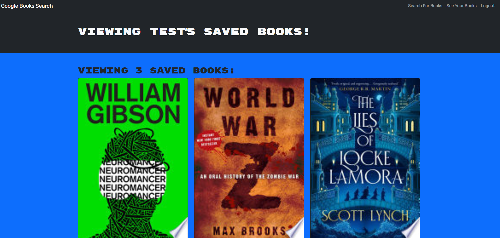

## Module 17 Challenge - Book Search Engine - For UMN Coding Bootcamp

# Description 
This is a class challenge to convert a web application from using a RESTful API to a GraphQL API built with Apollo Server. Users can search and save books to their account, and create a friend list. 

## Table of Contents

- [Usage](#usage)
- [Links](#links)

## Usage

<a href="https://book-search-engine-sc9n.onrender.com/">View the deployed site.</a>

## Links

Live Deployment - https://book-search-engine-sc9n.onrender.com/

Github Repository - https://github.com/sketchyTK/Book-Search-Engine